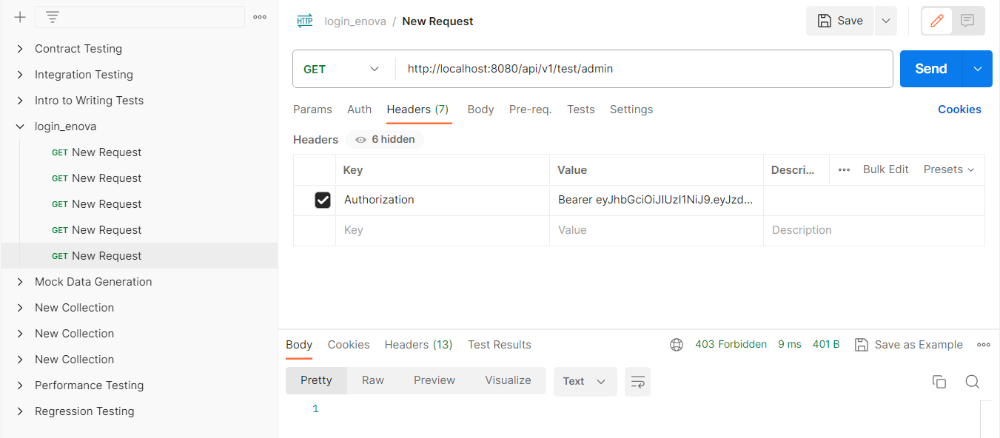

# login_back
run the following queries to populate your role table

INSERT INTO roles(name) VALUES('ROLE_USER');  
INSERT INTO roles(name) VALUES('ROLE_MODERATOR');  
INSERT INTO roles(name) VALUES('ROLE_ADMIN');  

testing the api/v1/auth/signup endpoint

testing the api/v1/auth/signin endpoint

testing public api/v1/test/all 

testing (must be authentificated regardless of the role that you have) api/v1/test/user

testing the same last endpoint but this time we passed the jwt in the header 

testing the endpoint of the moderator /api/v1/test/mod (the principal "currently logged in user" has the mod authorization)

trying to access the endpoint of the admin with mod permission (api/v1/test/admin)

