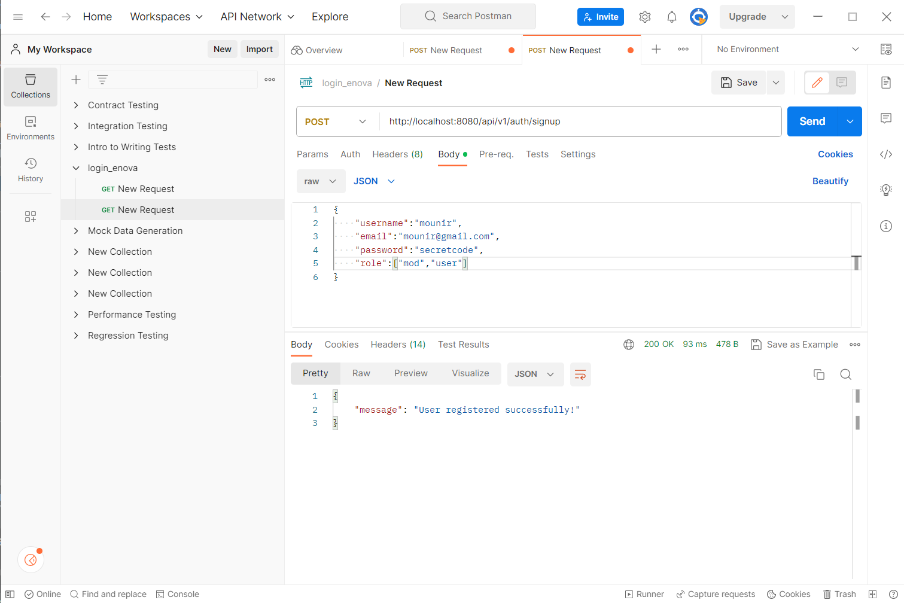

# login_back
run the following queries to populate your role table

INSERT INTO roles(name) VALUES('ROLE_USER');
INSERT INTO roles(name) VALUES('ROLE_MODERATOR');
INSERT INTO roles(name) VALUES('ROLE_ADMIN');

testing the signup endpoint

testing the signin endpoint

